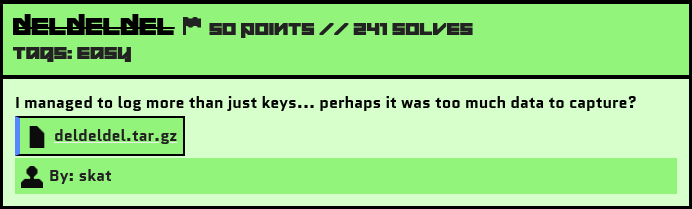
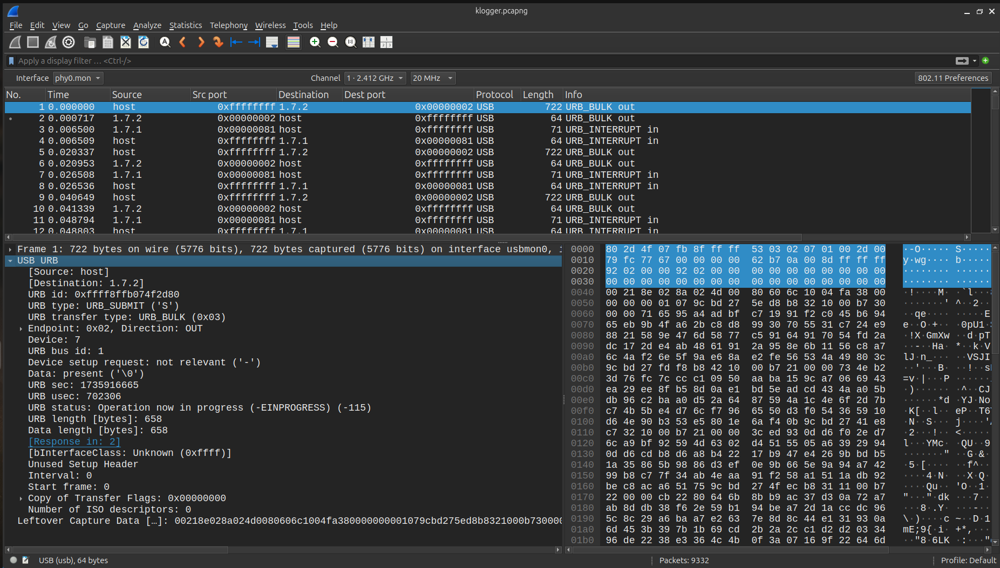
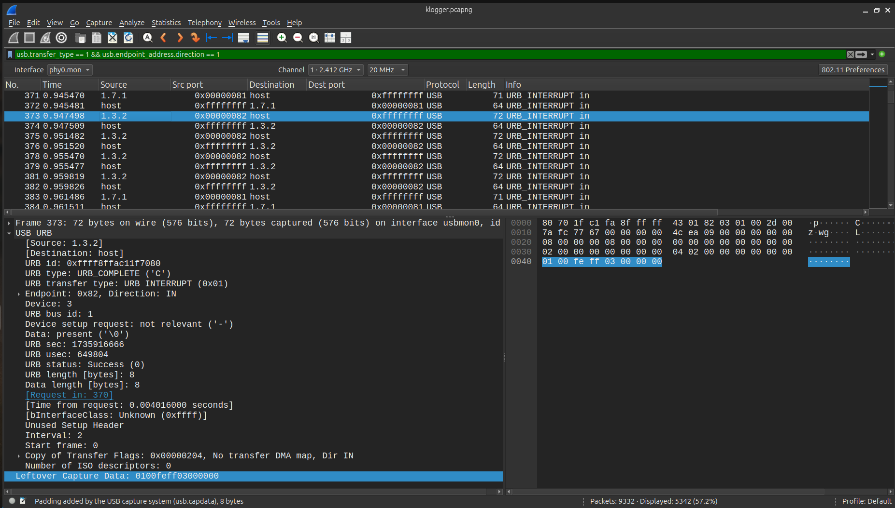

# Not Eelaborate

## Challenge Description



Source File: [deldeldel.tar.gz](./assets/deldeldel.tar.gz)

## Solution

```bash
$file klogger.pcapng 
klogger.pcapng: pcapng capture file - version 1.0
```

We received a .pcapng file for this challenge. When I opened it in Wireshark, the packets were exclusively based on the USB protocol.



The mention of "keys" and the file name klogger (key logger) hinted that this was likely a USB Keyboard/Keypad challenge.

USB Protocol challenges are a standard type in the Forensics category of CTFs and often repeat with slight modifications. The goal is to extract the USB HID data or CAP data available at the bottom of the packets, which contains useful information about the user's activity on the USB device.

Sources:
```
http://www.usb.org/developers/hidpage/ 

See section 10 Keyboard/Keypad Page (0x07) of document USB HID Usage Tables Version 1.12.

Definition of these 3 bytes can be found in section B.1 Protocol 1 (Keyboard) of document Device Class Definition for HID Version 1.11.
```

To analyze the user's activity, we check the flow of USB IN packets (packets sent from the device to the host). These are typically user activities.

### Filtering the USB IN Packets
To narrow down the USB IN packets, I applied the following filter in Wireshark:

`usb.transfer_type == 1 && usb.endpoint_address.direction == 1`



Here, we can see source IPs such as 1.3.2, 1.7.1, 1.5.1, and 1.5.2.

### Extracting USB CAP Data
The USB HID data/CAP data is usually 8 bytes. I started by analyzing the packets from 1.3.2, as they had 8-byte CAP data.

To extract the USB capture data, I used the tshark CLI. 

```bash
tshark -r klogger.pcapng -Y "usb.transfer_type == 1 && usb.endpoint_address.direction == 1 && usb.src==1.3.2" -T fields -e usb.capdata > data_1.3.2.txt
```

### Parsing USB CAP Data

For parsing the USB capture data into readable data, I used the following script:

```python
import sys

# USB HID Keymap for decoding key codes
KEY_CODES = {
    0x04: ['a', 'A'], 0x05: ['b', 'B'], 0x06: ['c', 'C'], 0x07: ['d', 'D'],
    0x08: ['e', 'E'], 0x09: ['f', 'F'], 0x0A: ['g', 'G'], 0x0B: ['h', 'H'],
    0x0C: ['i', 'I'], 0x0D: ['j', 'J'], 0x0E: ['k', 'K'], 0x0F: ['l', 'L'],
    0x10: ['m', 'M'], 0x11: ['n', 'N'], 0x12: ['o', 'O'], 0x13: ['p', 'P'],
    0x14: ['q', 'Q'], 0x15: ['r', 'R'], 0x16: ['s', 'S'], 0x17: ['t', 'T'],
    0x18: ['u', 'U'], 0x19: ['v', 'V'], 0x1A: ['w', 'W'], 0x1B: ['x', 'X'],
    0x1C: ['y', 'Y'], 0x1D: ['z', 'Z'], 0x1E: ['1', '!'], 0x1F: ['2', '@'],
    0x20: ['3', '#'], 0x21: ['4', '$'], 0x22: ['5', '%'], 0x23: ['6', '^'],
    0x24: ['7', '&'], 0x25: ['8', '*'], 0x26: ['9', '('], 0x27: ['0', ')'],
    0x28: ['\n', '\n'], 0x2A: ['[BACKSPACE]', '[BACKSPACE]'], 0x2B: ['\t', '\t'],
    0x2C: [' ', ' '], 0x2D: ['-', '_'], 0x2E: ['=', '+'], 0x2F: ['[', '{'],
    0x30: [']', '}'], 0x33: [';', ':'], 0x34: ["'", '"'], 0x36: [',', '<'],
    0x37: ['.', '>'], 0x38: ['/', '?'], 0x39: ['[CAPSLOCK]', '[CAPSLOCK]'],
    0x4F: [u'→', u'→'], 0x50: [u'←', u'←'], 0x51: [u'↓', u'↓'], 0x52: [u'↑', u'↑']
}

def decode_keylogger(file):
    with open(file, 'r') as f:
        lines = f.read().splitlines()

    decoded_output = ""
    for line in lines:
        if len(line) != 16:
            continue

        # Parse the 8-bytes payload
        modifier = int(line[0:2], 16)
        key_code = int(line[4:6], 16)

        # Ignore empty key codes
        if key_code == 0:
            continue

        # Decode keypress
        is_shift = (modifier & 0x02) != 0  # Check if Shift is active
        char = KEY_CODES.get(key_code, [''])[is_shift]  # Select shifted/unshifted char

        if char == '[BACKSPACE]':  # Handle backspace
            decoded_output = decoded_output[:-1]
        else:
            decoded_output += char

    return decoded_output

if __name__ == '__main__':
    if len(sys.argv) < 2:
        print('Usage: python3 script.py <data.txt>')
        sys.exit(1)

    file_path = sys.argv[1]
    result = decode_keylogger(file_path)
    print(result)
```

```bash
$python3 usbkeyboard.py data_1.3.2.txt 
gabaacbacaabbbbabbabcbbcccdcdcdcccbccbbcbaaaaaaaaabcabadadcacacbacaaabbbacbacbcbb
```
However, the data retrieved from 1.3.2 was garbage. I then moved on to another source IP (1.5.1), which also had 8-byte CAP data, and repeated the tshark steps.

```bash
$python3 usbkeyboard.py data_1.5.1.txt 
Hheey   AAalicce! Ii  tthink  Ii''m  ssupppooseed  too  giivee yoou   tiss fllaag:

iriisctfF{[tthis_akeyloggeer_iisS_too_hard_to_use}
```

### Creating the Flag
After extracting the data, I cleaned up the received flag and formatted it properly as per the challenge's defined format.

Flag: 
```yaml
irisctf{this_keylogger_is_too_hard_to_use}
```