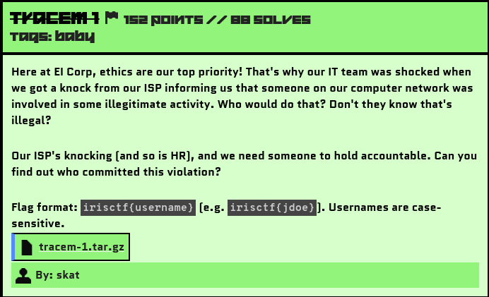

# Tracem1

## Challenge Description



Source File: [tracem-1.tar.gz](./assets/tracem-1.tar.gz)

## Solution

For this challenge, we need to identify the culprit. We were provided with a logs.json file packed with DHCP, DNS, Active Directory, and syslog logs.

- The DHCP Logs show the assignment of IP addresses.
- The DNS Logs contain records of IP address resolutions for websites.
- The Active Directory Logs include the names of the employees within the company.
- The Syslog Logs are primarily focused on authentication and also contain the names of the employees.

Let's analyze the file:

```json
{"host": "primary", "source": "stream:dns", "sourcetype": "stream:dns", "_time": "2024-12-04 06:30:39.50", "data": {"timestamp": "2024-12-04 06:30:38.816111", "protocol_stack": "ip:udp:dns", "transport": "udp", "src_ip": "10.49.0.2", "src_port": 53, "dest_ip": "10.49.81.65", "dest_port": 2561, "transaction_id": 54938, "answers": [{"type": "AAAA", "class": "IN", "name": "dropbox.com", "addr": "2620:100:6040:18::a27d:f812"}]}}
{"host": "primary", "source": "stream:dns", "sourcetype": "stream:dns", "_time": "2024-12-04 06:30:39.69", "data": {"timestamp": "2024-12-04 06:30:38.819396", "protocol_stack": "ip:udp:dns", "transport": "udp", "src_ip": "10.33.0.2", "src_port": 53, "dest_ip": "10.33.81.223", "dest_port": 10338, "transaction_id": 8697, "answers": [{"type": "AAAA", "class": "IN", "name": "hr.evil-insurance.corp", "addr": null}]}}
{"host": "primary", "source": "stream:dns", "sourcetype": "stream:dns", "_time": "2024-12-04 06:30:39.40", "data": {"timestamp": "2024-12-04 06:30:38.959049", "protocol_stack": "ip:udp:dns", "transport": "udp", "src_ip": "10.51.247.145", "src_port": 9037, "dest_ip": "10.51.0.2", "dest_port": 53, "transaction_id": 689, "queries": [{"type": "AAAA", "class": "IN", "name": "gitlab.evil-insurance.corp"}]}}
```
We can see references to many links accessed by different employees, along with their IP addresses and MAC addresses.

Since the challenge was related to computer networks, I started by checking all the URLs accessed by the employees.

```bash
grep -o '"name": *"[^"]*"' logs.json | sed -E 's/"name": *"([^"]*)"/\1/'
```
So these were the urls:

```yaml
connectivitycheck.gstatic.com
www.msftconnecttest.com
time.windows.com
.
it.evil-insurance.corp
evil-insurance.corp
chat.evil-insurance.corp
service.evil-insurance.corp
hr.evil-insurance.corp
gitlab.evil-insurance.corp
files.evil-insurance.corp
meetings.evil-insurance.corp
guestportal.evil-insurance.corp
sso.evil-insurance.corp
.
aftermarket.pl
bp0.blogger.com
copious-amounts-of-illicit-substances-marketplace.com
breachforums.st
smith-wesson.com
bmj.com
thedailybeast.com
welt.de
```
There were some safe sites, as well as sites related to the evil-insurance (EI) Corp Company.

Out of all the sites, I found the following to be very suspicious:

```yaml
copious-amounts-of-illicit-substances-marketplace.com
breachforums.st
```

Since these sites were also matching the keywords mentioned in the description, I proceeded to check who accessed both of these sites.

```bash
$strings logs.json | grep -E "copious-amounts-of-illicit-substances-marketplace.com|breachforums.st"
{"host": "primary", "source": "stream:dns", "sourcetype": "stream:dns", "_time": "2024-12-04 06:30:18.99", "data": {"timestamp": "2024-12-04 06:30:18.347812", "protocol_stack": "ip:udp:dns", "transport": "udp", "src_ip": "10.33.18.209", "src_port": 7419, "dest_ip": "10.33.0.2", "dest_port": 53, "transaction_id": 45042, "queries": [{"type": "A", "class": "IN", "name": "copious-amounts-of-illicit-substances-marketplace.com"}]}}
{"host": "primary", "source": "stream:dns", "sourcetype": "stream:dns", "_time": "2024-12-04 06:30:19.21", "data": {"timestamp": "2024-12-04 06:30:18.572830", "protocol_stack": "ip:udp:dns", "transport": "udp", "src_ip": "10.33.0.2", "src_port": 53, "dest_ip": "10.33.18.209", "dest_port": 7419, "transaction_id": 45042, "answers": [{"type": "A", "class": "IN", "name": "copious-amounts-of-illicit-substances-marketplace.com", "addr": "104.16.148.244"}]}}
{"host": "primary", "source": "stream:dns", "sourcetype": "stream:dns", "_time": "2024-12-04 06:33:36.80", "data": {"timestamp": "2024-12-04 06:33:36.803488", "protocol_stack": "ip:udp:dns", "transport": "udp", "src_ip": "10.33.18.209", "src_port": 52836, "dest_ip": "10.33.0.2", "dest_port": 53, "transaction_id": 50295, "queries": [{"type": "A", "class": "IN", "name": "breachforums.st"}]}}
{"host": "primary", "source": "stream:dns", "sourcetype": "stream:dns", "_time": "2024-12-04 06:33:37.18", "data": {"timestamp": "2024-12-04 06:33:37.175597", "protocol_stack": "ip:udp:dns", "transport": "udp", "src_ip": "10.33.0.2", "src_port": 53, "dest_ip": "10.33.18.209", "dest_port": 52836, "transaction_id": 50295, "answers": [{"type": "A", "class": "IN", "name": "breachforums.st", "addr": "185.129.102.136"}]}}
{"host": "primary", "source": "stream:dns", "sourcetype": "stream:dns", "_time": "2024-12-04 06:50:51.87", "data": {"timestamp": "2024-12-04 06:50:51.748497", "protocol_stack": "ip:udp:dns", "transport": "udp", "src_ip": "10.33.18.209", "src_port": 22966, "dest_ip": "10.33.0.2", "dest_port": 53, "transaction_id": 33048, "queries": [{"type": "A", "class": "IN", "name": "breachforums.st"}]}}
{"host": "primary", "source": "stream:dns", "sourcetype": "stream:dns", "_time": "2024-12-04 06:50:52.14", "data": {"timestamp": "2024-12-04 06:50:52.021816", "protocol_stack": "ip:udp:dns", "transport": "udp", "src_ip": "10.33.0.2", "src_port": 53, "dest_ip": "10.33.18.209", "dest_port": 22966, "transaction_id": 33048, "answers": [{"type": "A", "class": "IN", "name": "breachforums.st", "addr": "185.129.102.136"}]}}
```

As expected, the same IP address (10.33.18.209) accessed both of these sites.

Let's analyze the syslog:

```json
{"host": "primary", "source": "udp:514", "sourcetype": "syslog", "_time": "2024-12-04 04:58:36.95", "data": {"_raw": "2024-12-04 04:58:35.622504||https://sso.evil-insurance.corp/idp/profile/SAML2/Redirect/SSO|/idp/profile/SAML2/Redirect/SSO|5b52053ac1ab1f4935a3d7d6c6aa4ff0|authn/MFA|10.33.18.209|Mozilla/5.0 (Windows NT 10.0; Win64; x64) AppleWebKit/537.36 (KHTML, like Gecko) Chrome/58.0.3029.110 Safari/537.3 Edge/16.16299|https://sso.evil-insurance.corp/ns/profiles/saml2/sso/browser|llloyd||uid|service.evil-insurance.corp|https://sso.evil-insurance.corp/idp/sso|url:oasis:names:tc:SAML:2.0:protocol|urn:oasis:names:tc:SAML:2.0:bindings:HTTP-Redirect|urn:oasis:names:tc:SAML:2.0:bindings:HTTP-POST|kzYQV+Jk2w3KkwmRjR+HK4QWVQ3qzLPLgA5klV2b8bQT+NLYLeqCZw5xUGKbx1U1158jlnUYRrILtVTtMkMdbA==|urn:oasis:names:tc:SAML:2.0:nameid-format:transient|_60b0fd4b0ed5bba3474faeb85b3944e|2024-12-04 04:58:35.622504|_c4b56d58-625b-49aa-b859-4a2068422979||||urn:oasis:names:tc:SAML:2.0:status:Success|||false|false|true", "timestamp": "2024-12-04 04:58:35.622504", "NLYLeqCZw5xUGKbx1U1158jlnUYRrILtVTtMkMdbA": "=|urn:oasis:names:tc:SAML:2.0:nameid-format:transient|_60b0fd4b0ed5bba3474faeb85b3944e|2024-12-04"}}
```

I then checked the syslog for this IP address and found the name of the employee associated with it: `llloyd`.

### Creating the Flag
With the gathered information, I constructed the flag using the defined format, and boom, that was the correct flag.

Flag: 
```yaml
irisctf{llloyd}
```