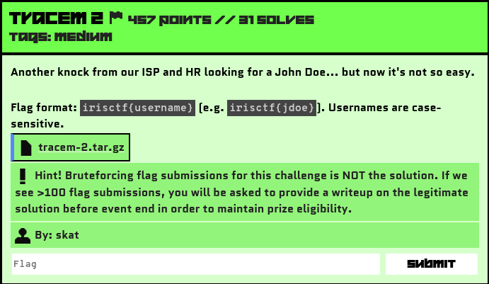

# Tracem2

## Challenge Description



Source File: [tracem-2.tar.gz](./assets/tracem-2.tar.gz)

Yeah some of the teams had 600+ and 1300+ attempts.😂
## Solution

This challenge is a continuation of the Tracem1 challenge. For better context, you can refer to my Tracem1 write-up. Unfortunately, I was only able to solve this challenge partially during the CTF duration 🥹. I delved too deeply into analysis and missed a critical clue. However, I’ll share all the data and steps I took while solving it.
 
### Challenge Overview
We received a logs.json file for this challenge. Similar to Tracem1, I began analyzing the logs.

Here are some notable sites accessed in the logs.json file:
```yaml
detectportal.firefox.com
www.msftconnecttest.com
.
3.fedora.pool.ntp.org
0.arch.pool.ntp.org
globo.com
reg.ru
1.ubuntu.pool.ntp.org
politico.com
enable-javascript.com
mozilla.com
fb.me
20minutos.es
last.fm
xda-developers.com
unicef.org
nypost.com
target.com
kickstarter.com
2.arch.pool.ntp.org
.
gitlab.evil-insurance.corp
hr.evil-insurance.corp
files.evil-insurance.corp
meetings.evil-insurance.corp
it.evil-insurance.corp
evil-insurance.corp
chat.evil-insurance.corp
service.evil-insurance.corp
guestportal.evil-insurance.corp
sso.evil-insurance.corp
evil-insurance.corp
.
ubuntu.com
thepiratebay.org
generic-illicit-activities-hub.org
deloitte.com
bp0.blogger.com
```

These two sites seemed suspicious:

- thepiratebay.org
- generic-illicit-activities-hub.org

I then identified the user who accessed both sites:

```bash
$strings logs.json | grep -E "thepiratebay.org|generic-illicit-activities-hub.org"
{"host": "primary", "source": "stream:dns", "sourcetype": "stream:dns", "_time": "2024-12-04 08:51:51.12", "data": {"timestamp": "2024-12-04 08:51:51.092921", "protocol_stack": "ip:udp:dns", "transport": "udp", "src_ip": "10.18.21.121", "src_port": 48851, "dest_ip": "10.18.0.2", "dest_port": 53, "transaction_id": 119, "queries": [{"type": "A", "class": "IN", "name": "thepiratebay.org"}]}}
{"host": "primary", "source": "stream:dns", "sourcetype": "stream:dns", "_time": "2024-12-04 08:51:51.13", "data": {"timestamp": "2024-12-04 08:51:51.102210", "protocol_stack": "ip:udp:dns", "transport": "udp", "src_ip": "10.18.21.121", "src_port": 2975, "dest_ip": "10.18.0.2", "dest_port": 53, "transaction_id": 13007, "queries": [{"type": "AAAA", "class": "IN", "name": "thepiratebay.org"}]}}
{"host": "primary", "source": "stream:dns", "sourcetype": "stream:dns", "_time": "2024-12-04 08:51:53.22", "data": {"timestamp": "2024-12-04 08:51:52.449001", "protocol_stack": "ip:udp:dns", "transport": "udp", "src_ip": "10.18.0.2", "src_port": 53, "dest_ip": "10.18.21.121", "dest_port": 48851, "transaction_id": 119, "answers": [{"type": "A", "class": "IN", "name": "thepiratebay.org", "addr": "104.16.148.244"}]}}
{"host": "primary", "source": "stream:dns", "sourcetype": "stream:dns", "_time": "2024-12-04 08:51:53.22", "data": {"timestamp": "2024-12-04 08:51:52.450021", "protocol_stack": "ip:udp:dns", "transport": "udp", "src_ip": "10.18.0.2", "src_port": 53, "dest_ip": "10.18.21.121", "dest_port": 2975, "transaction_id": 13007, "answers": [{"type": "AAAA", "class": "IN", "name": "thepiratebay.org", "addr": null}]}}
{"host": "primary", "source": "stream:dns", "sourcetype": "stream:dns", "_time": "2024-12-04 09:05:01.12", "data": {"timestamp": "2024-12-04 09:05:00.400067", "protocol_stack": "ip:udp:dns", "transport": "udp", "src_ip": "10.18.21.121", "src_port": 22066, "dest_ip": "10.18.0.2", "dest_port": 53, "transaction_id": 2835, "queries": [{"type": "A", "class": "IN", "name": "generic-illicit-activities-hub.org"}]}}
{"host": "primary", "source": "stream:dns", "sourcetype": "stream:dns", "_time": "2024-12-04 09:05:00.70", "data": {"timestamp": "2024-12-04 09:05:00.520979", "protocol_stack": "ip:udp:dns", "transport": "udp", "src_ip": "10.18.21.121", "src_port": 64559, "dest_ip": "10.18.0.2", "dest_port": 53, "transaction_id": 3019, "queries": [{"type": "AAAA", "class": "IN", "name": "generic-illicit-activities-hub.org"}]}}
{"host": "primary", "source": "stream:dns", "sourcetype": "stream:dns", "_time": "2024-12-04 09:05:01.76", "data": {"timestamp": "2024-12-04 09:05:01.197568", "protocol_stack": "ip:udp:dns", "transport": "udp", "src_ip": "10.18.0.2", "src_port": 53, "dest_ip": "10.18.21.121", "dest_port": 22066, "transaction_id": 2835, "answers": [{"type": "A", "class": "IN", "name": "generic-illicit-activities-hub.org", "addr": "96.16.243.221"}]}}
{"host": "primary", "source": "stream:dns", "sourcetype": "stream:dns", "_time": "2024-12-04 09:05:01.72", "data": {"timestamp": "2024-12-04 09:05:01.201187", "protocol_stack": "ip:udp:dns", "transport": "udp", "src_ip": "10.18.0.2", "src_port": 53, "dest_ip": "10.18.21.121", "dest_port": 64559, "transaction_id": 3019, "answers": [{"type": "AAAA", "class": "IN", "name": "generic-illicit-activities-hub.org", "addr": null}]}}
```

### Suspicious User Identification

The suspicious user had the following attributes:

```
IP Address: 10.18.21.121
MAC Address: de:ad:be:ef:ca:fe (a spoofed address)
```

#### Activity Timeline of the Suspicious User

| Event                          | Time of the event             |
|--------------------------------|-------------------------------|
| Req for the addr 10.18.21.121  | 2024-12-04 08:49:20.52        |
| Get assigned that addr         | 2024-12-04 08:49:21.00        |
| Access www.google.com          | 2024-12-04 08:49:34.58        |
| Access 2.arch.pool.ntp.org     | 2024-12-04 08:51:18.72        |
| Access thepiratebay.org        | 2024-12-04 08:51:51.12        |
| Access generic-illicit-activities-hub.org| 2024-12-04 09:05:01.12|
| Releases the IP addr           | 2024-12-04 09:22:01.12        |


This was another challenge in the Tracem series, so it wasn’t going to be straightforward to solve via syslog logs. Additionally, the suspicious IP (10.18.21.121) didn’t have any corresponding syslog logs, making direct identification of the user more difficult.

Since I had already established that the suspicious IP (10.18.21.121) was the only one to access the two suspicious sites (thepiratebay.org and generic-illicit-activities-hub.org), I decided to investigate further.

To narrow down potential leads, I began analyzing who else accessed 2.arch.pool.ntp.org.

I got these result:
```
10.50.103.29
10.66.91.95
10.66.68.75
10.17.161.10
10.34.192.28
10.65.26.90
10.65.68.160
10.51.64.145
10.66.156.255
10.35.126.228
10.67.252.116
10.17.6.47
10.50.184.143
10.18.21.121
10.49.220.32
10.49.79.62
10.49.65.21
10.17.90.14
10.17.26.247
10.17.171.253
10.65.228.127
```

### Initial Misstep
At this point, I noticed that the user accessed 2.arch.pool.ntp.org, a relatively common URL. I assumed it wasn’t suspicious and did not cross-reference other IPs that accessed this site during the same timeframe. This was my critical oversight.

Feel free to skip the rest if you'd like—I’ll now share what I explored after this step.

### Investigation Details
#### Extraction and Analysis
1. MAC Addresses:

I extracted all MAC addresses to look for other spoofed addresses but found no results.

2. IP Segmentation:

I identified recurring IP ranges in the logs:

```
10.17.X.X
10.18.X.X
10.19.X.X
10.33.X.X
10.34.X.X
10.35.X.X
10.49.X.X
10.50.X.X
10.51.X.X
10.65.X.X
10.66.X.X
10.67.X.X
```

3. Syslog SSO Logs:

Only the following IP ranges appeared in syslog SSO logs:

```
10.17.X.X
10.19.X.X
10.33.X.X
10.35.X.X
10.49.X.X
10.51.X.X
10.65.X.X
10.67.X.X
```

So it was certain that I would get the username from this set of IPs.

Looking at these IPs, I thought this challenge might be based on Network Segmentation. It appeared that there were four buildings and three subnets, which Skat later confirmed on Discord.

4. Network Proximity Assumptions:

I hypothesized that the suspicious user might have moved laterally to a new subnet, maintaining the same host/octet structure.

From 10.17.X.X and 10.19.X.X:

- Likely Subnets: 10.17.21.xxx, 10.17.121.xxx, etc.
- Likely Hosts: 10.17.x.121.

Despite exploring these, I found no leads.

Then I moved on to checking the full logs.json file around the timeline of the IP guy. By this time, this challenge was my last one left, and I was very tired, so I couldn’t search properly.

### Aftermath

After the CTF Competition, Jakob (discord) mentioned that I should have checked the IPs accessing 2.arch.pool.ntp.org around the timeline of the suspicious user (10.18.21.121).😿

[Jakob's Tracem2 Writeup](https://team-bytesized.github.io/ctf/iris2025/writeups/tracem-2.html)

#### Key Table (from Jakob's Write-Up):

| Timestamp                  |              Events |                    Notes|
|----------------------------|---------------------|--------------------------|
| 2024-12-04 08:45:33.555166 | 10.17.161.10 ( mhammond ) disconnects from network | releases 10.17.161.10 + pause in traffic from 10.17.161.10 |
| 2024-12-04 09:42:00.907257 | IP assignment to 10.17.161.10 ( mhammond ) | traffic from 10.17.161.10 continues |


This IP (10.17.161.10) was the closest to the suspicious user's timeline. The username associated with this IP was `mhammond`, making them the culprit.

Flag: 
```yaml
irisctf{mhammond}
```

## Reflection
This challenge reinforced the importance of checking all data points and avoiding assumptions during investigations. Despite missing the critical clue during the competition, I gained valuable insights and improved my analysis techniques.
Thanks `skat` for the cool challenges.
