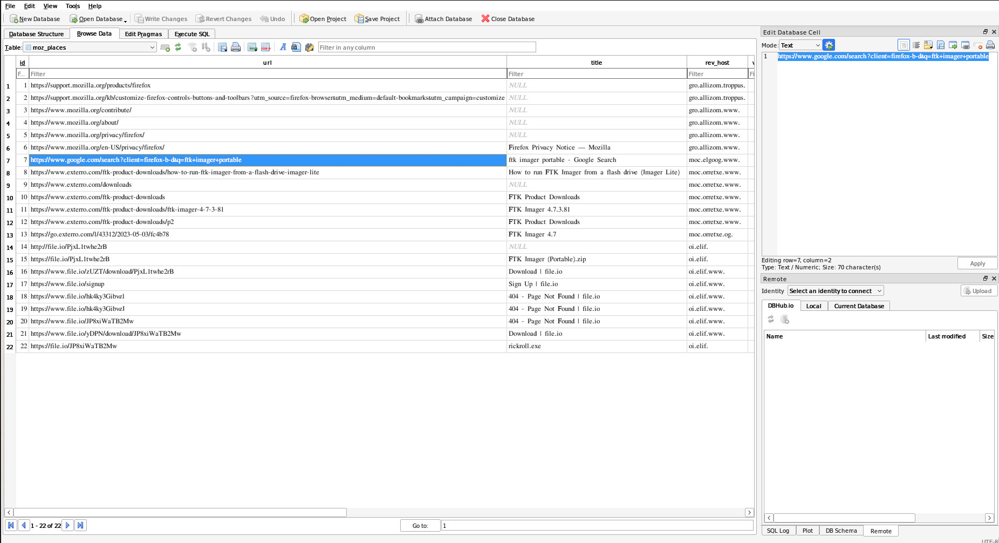

# Windy Day

## Challenge Description


## Solution

We received a memory dump for this challenge. The title, `Windy Day`, hints towards Windows OS, and the description, `lost track of an important note...`, suggests we may need to retrieve some crucial information from the memory.

### Initial Analysis

I started analyzing the memory dump using [Volatility3](https://github.com/volatilityfoundation/volatility3).

```bash
$python3 vol.py -f memdump.mem windows.info
Volatility 3 Framework 2.12.0
Progress:  100.00		PDB scanning finished                        
Variable	Value

Kernel Base	0xf80365200000
DTB	0x1ab000
Symbols	file:///home/ubuntu/volatility3/volatility3/symbols/windows/ntkrnlmp.pdb/D5E3E35C1C2D48E9906F43C7C05FA3F0-1.json.xz
Is64Bit	True
IsPAE	False
layer_name	0 WindowsIntel32e
memory_layer	1 FileLayer
KdVersionBlock	0xf803654f4df8
Major/Minor	15.14393
MachineType	34404
KeNumberProcessors	1
SystemTime	2025-01-03 17:11:15+00:00
NtSystemRoot	C:\Windows
NtProductType	NtProductServer
NtMajorVersion	10
NtMinorVersion	0
PE MajorOperatingSystemVersion	10
PE MinorOperatingSystemVersion	0
PE Machine	34404
PE TimeDateStamp	Tue Oct 22 04:58:19 2024
```
As usual, I first listed all the processes. 

```bash
$python3 vol.py -f memdump.mem windows.pslist
Volatility 3 Framework 2.12.0
Progress:  100.00		PDB scanning finished                        
PID	PPID	ImageFileName	Offset(V)	Threads	Handles	SessionId	Wow64	CreateTime	ExitTime	File output

4	0	System	0xe38cb727f6c0	98	-	N/A	False	2025-01-03 16:50:11.000000 UTC	N/A	Disabled
.
.
3036	4060	firefox.exe	0xe38cb818b500	89	-	1	True	2025-01-03 16:55:40.000000 UTC	N/A	Disabled
3968	3036	firefox.exe	0xe38cb75b9080	22	-	1	True	2025-01-03 16:55:41.000000 UTC	N/A	Disabled
3624	3036	firefox.exe	0xe38cbb380080	5	-	1	True	2025-01-03 16:55:41.000000 UTC	N/A	Disabled
3828	3036	firefox.exe	0xe38cbb539800	17	-	1	True	2025-01-03 16:55:43.000000 UTC	N/A	Disabled
2420	3036	firefox.exe	0xe38cbb711800	5	-	1	True	2025-01-03 16:55:44.000000 UTC	N/A	Disabled
4076	3036	firefox.exe	0xe38cbb116080	17	-	1	True	2025-01-03 16:55:45.000000 UTC	N/A	Disabled
3132	3036	firefox.exe	0xe38cbb1e1080	5	-	1	True	2025-01-03 16:55:47.000000 UTC	N/A	Disabled
712	     628	ApplicationFra 0xe38cbb573080	1	-	1	False	2025-01-03 16:56:02.000000 UTC	N/A	Disabled
5044	3036	firefox.exe	0xe38cbb7c8800	5	-	1	True	2025-01-03 16:56:43.000000 UTC	N/A	Disabled
4772	3036	firefox.exe	0xe38cbb0d6300	18	-	1	True	2025-01-03 16:57:38.000000 UTC	N/A	Disabled
1380	2856	FTK Imager.exe 0xe38cbb82e800	20	-	1	False	2025-01-03 17:02:19.000000 UTC	N/A	Disabled
5324	3036	firefox.exe	0xe38cbba94080	19	-	1	True	2025-01-03 17:09:52.000000 UTC	N/A	Disabled
5804	3036	firefox.exe	0xe38cbb261080	19	-	1	True	2025-01-03 17:09:56.000000 UTC	N/A	Disabled
2308	3036	firefox.exe	0xe38cbbb44080	19	-	1	True	2025-01-03 17:09:56.000000 UTC	N/A	Disabled
2712	3036	firefox.exe	0xe38cbba16080	19	-	1	True	2025-01-03 17:09:56.000000 UTC	N/A	Disabled
3328	3036	firefox.exe	0xe38cbb8c6800	19	-	1	True	2025-01-03 17:09:56.000000 UTC	N/A	Disabled
6256	3036	firefox.exe	0xe38cbb884800	19	-	1	True	2025-01-03 17:09:56.000000 UTC	N/A	Disabled
5288	3036	firefox.exe	0xe38cbb8a9800	19	-	1	True	2025-01-03 17:09:56.000000 UTC	N/A	Disabled
5664	3036	firefox.exe	0xe38cbb7c9080	19	-	1	True	2025-01-03 17:09:56.000000 UTC	N/A	Disabled
5196	3036	firefox.exe	0xe38cbb8c0800	19	-	1	True	2025-01-03 17:09:56.000000 UTC	N/A	Disabled
4508	3036	firefox.exe	0xe38cbbbe8800	19	-	1	True	2025-01-03 17:09:59.000000 UTC	N/A	Disabled
4344	3036	firefox.exe	0xe38cbbbb8080	19	-	1	True	2025-01-03 17:10:00.000000 UTC	N/A	Disabled
928	    3036	firefox.exe	0xe38cbbc8c080	19	-	1	True	2025-01-03 17:10:00.000000 UTC	N/A	Disabled
740	    3036	firefox.exe	0xe38cbb89e400	19	-	1	True	2025-01-03 17:10:01.000000 UTC	N/A	Disabled
2252	3036	firefox.exe	0xe38cb7e25080	19	-	1	True	2025-01-03 17:10:01.000000 UTC	N/A	Disabled
2920	3036	firefox.exe	0xe38cbbc9e080	19	-	1	True	2025-01-03 17:10:01.000000 UTC	N/A	Disabled
3124	3036	firefox.exe	0xe38cbbca0080	19	-	1	True	2025-01-03 17:10:01.000000 UTC	N/A	Disabled
7116	3036	firefox.exe	0xe38cb7e32680	19	-	1	True	2025-01-03 17:10:01.000000 UTC	N/A	Disabled
```

Among them, I noticed multiple firefox.exe processes running. I decided to dump all the files of the Firefox process with PID 3036:

```bash
$python3 vol.py -f memdump.mem windows.dumpfiles --pid 3036
```
This command yielded some DLLs and database files such as .db and .sqlite.

```
permissions.sqlite  favicons.sqlite  cookies.sqlite  places.sqlite  formhistory.sqlite  storage.sqlite  cert9.db  key4.db 
domain_to_categories.sqlite  protections.sqlite  content-prefs.sqlite  bounce-tracking-protection.sqlite  data.sqlite
```
### Exploring the Databases
I analyzed these database files using DB Browser.

The places.sqlite and cookies.sqlite files contained search history data. Below is a snapshot of the data from places.sqlite:



Initially, I suspected that the flag might have been uploaded to a file-sharing site like file.io. I explored the file.io site links but found no useful results.

### Further Investigation
Next, I dumped the memory of the firefox.exe process for deeper analysis:

```bash
$python3 vol.py -f memdump.mem windows.memmap --pid 3036 --dump
```
This generated a pid.3036.dmp file. I ran strings on this file and noticed several links, which led me to Google Sites.

```bash
$strings pid.3036.dmp | grep "https://www.google.com/search?"
{"1":{"0":"https://www.google.com/search?client=firefox-b-d&q=ftk+imager+portable"}}
https://www.google.com/search?client=firefox-b-d&q=ftk+imager+portable ftk imager portable - Google Search
https://www.google.com/search?client=firefox-b-d&q=
https://www.google.com/search?client=firefox-b-d&q=ftk+imager+portable
https://www.google.com/search?client=firefox-b-d&q=
https://www.google.com/search?client=firefox-b-d&q=aXJpc2N0ZntpX2FtX2
.
.
https://www.google.com/search?client=firefox-b-d&q=aXJpc2N0ZntpX2FtX2FuX2lkaW90X3dpdGhfYmFkX21lbW9yeX0%3D
.
```
Among the search queries, one appeared to be encoded in Base64.

### Decoding the Base64 String
I decoded the Base64 string using the following command:

```bash
$echo "aXJpc2N0ZntpX2FtX2FuX2lkaW90X3dpdGhfYmFkX21lbW9yeX0=" | base64 -d
irisctf{i_am_an_idiot_with_bad_memory}
```

Boom! We got our flag!!!

Flag: 
```yaml
irisctf{i_am_an_idiot_with_bad_memory}
```

### Alternate Approach
Later, I realized the same result could have been achieved by directly running strings with base64 of "irisctf{" on the main memdump.mem file, which would have saved some effort. 😛
