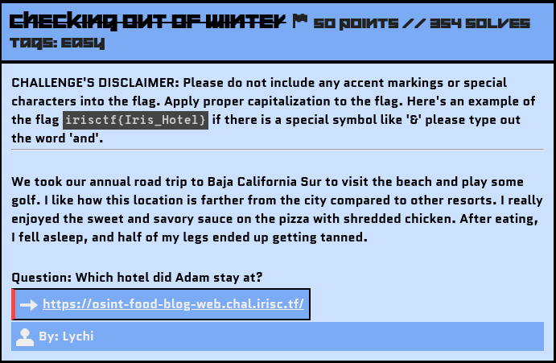
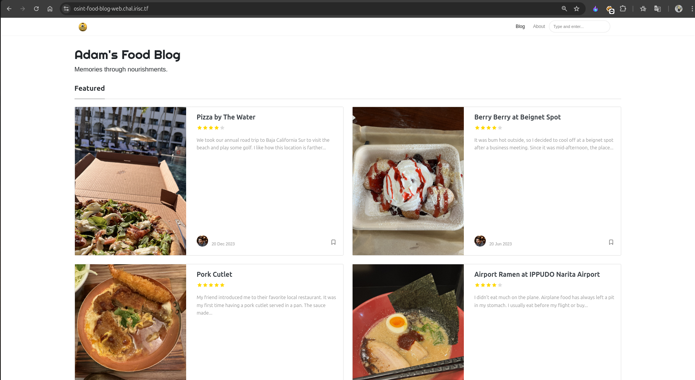
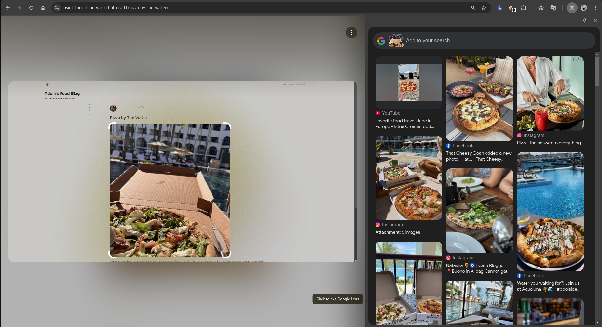

# CHECKING OUT OF WINTER

## Challenge Description



Blog's Link: https://osint-food-blog-web.chal.irisc.tf/

## Message

For beginners, I would say that doing OSINT challenges is really fun and makes you feel like an investigator. You just have to narrow down the useful data from all the information available to you. Always check for keywords, regional distinctions, special marks, or buildings, as the victim often leaves minor traces by mistake, which can help you identify them.

I created this writeup in detail, especially for first-time solvers. 😉


## Solution

In the challenge description, keywords like *Baja California Sur, Beach, Golf, and Hotel's location farther from the main city* are traces left by the victim that can help us move forward.

### Exploring the Clues
Let’s visit the website:




On the website, we find many blogs and stories by Adam about the places he visited and the food he ate. 

By matching the description, we identify that the `Pizza by The Water` blog is the most relevant one for this challenge.


In the blog's image, we notice the hotel's architecture in the background, along with a pool. Since we have an image related to the location, we can perform a [Reverse Image Search](https://en.wikipedia.org/wiki/Reverse_image_search) using Google Lens.

```
Note: If the location is based in Russia, Yandex is preferable for reverse image searches. Similarly, if a country has its own powerful search engine, use that for better results.
```




Initially, when I searched using the full image (including the pizza and the hotel), most results were about pizzas, related sites, and posts.

To refine the search, we need to narrow down the content we are focusing on. For the next search, I used only the hotel's image and included the location Baja California Sur. This helped narrow down the results significantly.


In the refined search results, as seen above, the AI and other sites directly suggested the hotel's name, unlike the first search. This demonstrates the importance of crafting an effective search prompt, as search engines have vast amounts of data to process.

### Creating the Flag
With the gathered information, let's construct the flag using the defined format.

Flag: 
```yaml
irisctf{Hilton_Los_Cabos_Beach_and_Golf_Resort}
```
Hurray!!!