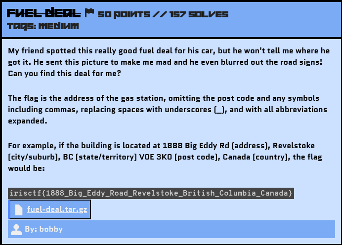
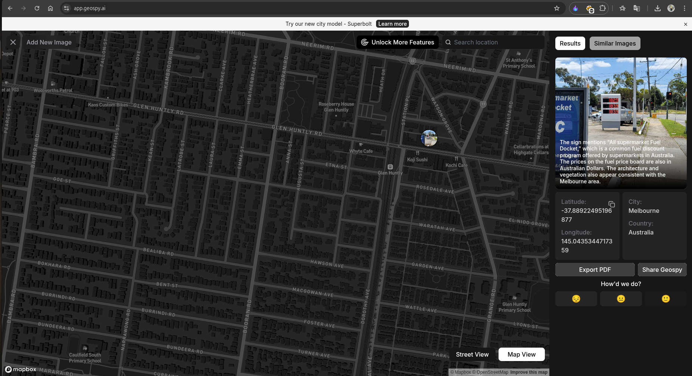

# Fuel Deal

## Challenge Description



Source File: [fuel-deal.tar.gz](./assets/fuel-deal.tar.gz)

## Solution

If you came directly to this challenge's writeup, I will recommend you first read my `Checking Out Of Winter` writeup because I have made it in detail, specifying some important notes.

So again, let's search for the keywords. I got this: *Good Fuel Deal*.
 


I did a Reverse Image Search but didn’t get much of a lead. Then, I tried one of the cool tools, [GeoSpy AI](https://geospy.ai/), which showed me this result:



Not every time does this AI give you the correct location, but since there were mentions of Australia in my Google Image Search, I decided to try the suggested location, Melbourne, Australia.

I then searched on Google with the query: `Where were the cheap fuels (with the rate price mentioned in the provided image) in Melbourne?` and got some of these results:

```
The cheapest diesel available in Victoria costs 183.9 cents per litre.
```

Then found this helpful site : https://www.carexpert.com.au/car-news/the-cheapest-petrol-and-diesel-around-australia-this-week\

The above site had these rates : 

```less
Victoria-

The cheapest unleaded petrol in Victoria today costs 169.9 cents per litre. You can find it at Liberty Pakenham.

The cheapest diesel available in Victoria costs 183.9 cents per litre. You can find it at SE Fuel in Mount Waverley.

Metro – Melbourne	                                Statewide
Unleaded 91	183.9 (Metro Petroleum Maribynong)	    169.9 (Liberty Pakenham)
Premium Unleaded 95	187.9 (APCO Hoppers Crossing)	191.5 (APCO Bendigo)
Premium Unleaded 98	204 (Liberty Baxter)	        197.9 (Shell Heywood)
Diesel	183.9 (SE Fuel Mount Waverley)	            189.1 (Independent Morwell)
```

I started searching with all the locations mentioned above from the beginning. Finally, when I was searching for the `SE Fuel Mount Waverly` location on Google Maps, I found some of these fuel stations:


After scrolling down, I identified that the Shell station was the desired fuel station. If you check the photos or the 360-degree view of that location, it was identifiable with the provided image.

Location : [Shell](https://maps.app.goo.gl/3CazWSRMCeDk5Wip7)

### Creating the Flag
With the gathered information, let's construct the flag using the defined format.

Flag: 
```yaml
irisctf{203_Gallaghers_Road_Glen_Waverley_Victoria_Australia}
```
Woah!!!