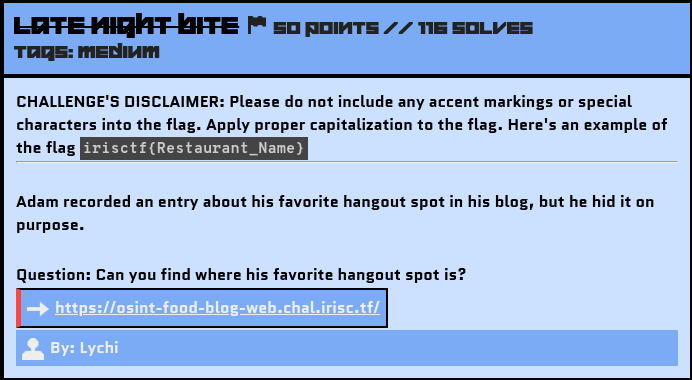
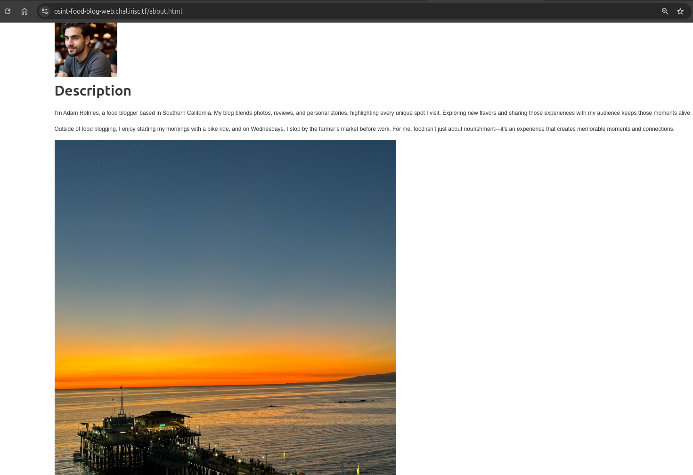
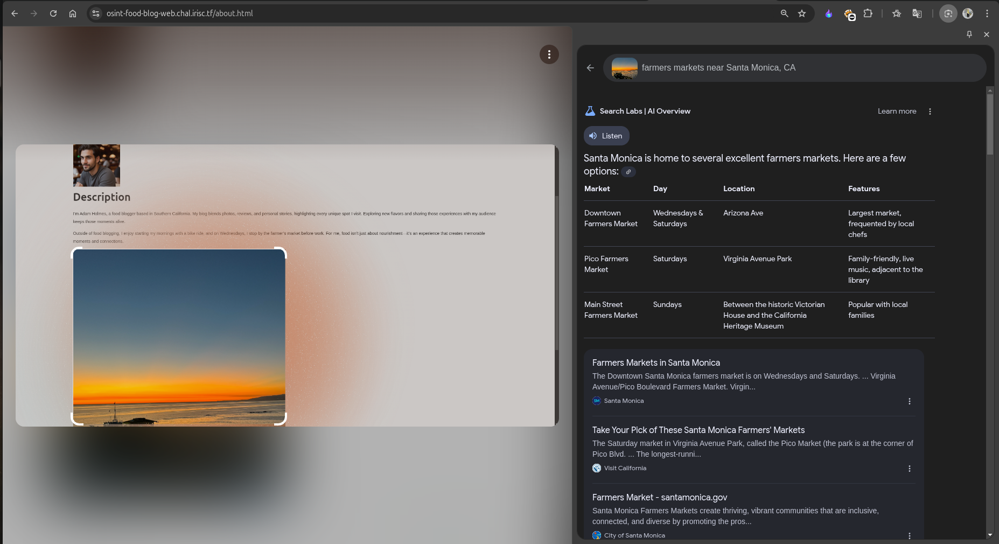
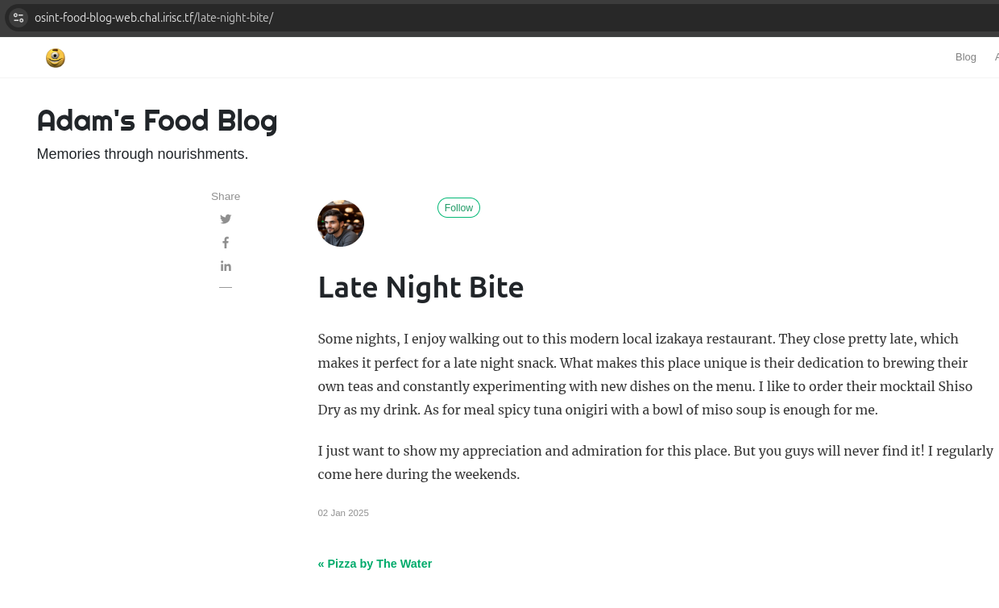
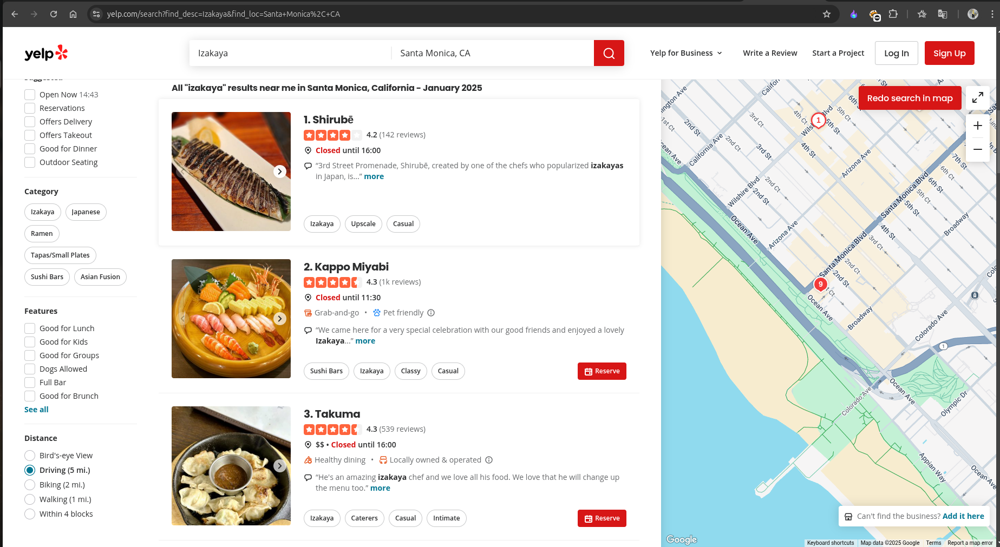

# Late Night Bite

## Challenge Description



Blog's Link: https://osint-food-blog-web.chal.irisc.tf/

## Solution

If you came directly to this challenge's writeup, I will recommend you first read my `Checking Out Of Winter` writeup because I have made it in detail, specifying some important notes.

This challenge was a little tricky. Let's start.

According to the description, Adam hid his favorite hangout spot, which he had recorded in the past.

At first, I thought he didn’t directly mention the Late Night Bite blog, so I explored the other uncovered blogs but didn’t find anything useful related to the challenge.

Then, I went to the `About` section of Adam's site.



In the About section, I noticed that Adam is a food blogger based in Southern California and that on Wednesdays, he stops by the farmer’s market before work.

I speculated that the farmer's market might be the nearest location around his house. When I did a Reverse Image Search on the image provided in the About section, I realized the location was `Santa Monica Pier`.

I then did another Reverse Image Search with the prompt:



I believed Adam was talking about the `Downtown Farmers Market` because of the Wednesday mention.

But I still didn’t have any clue about the restaurant's name, so I started searching through the blog on his site again. Since I have some foundational knowledge of web dev/exp, I began by viewing the Page Source. In the source, Adam mentioned this line:

```
<!-- MY SUPER SECRET POST: "late night bite" -->
```

Then, I tried the robots.txt endpoint – https://osint-food-blog-web.chal.irisc.tf/robots.txt.

There, I found a mention of: Sitemap: /sitemap.xml.

I went to this endpoint and discovered every endpoint related to his blogs. After scrolling, I found a mention of the Late Night Bite blog as:

```
<url>
<loc>/late-night-bite/</loc>
<lastmod>2025-01-02T00:00:00-08:00</lastmod>
</url>
```
So, finally, I found the blog that was hidden by Adam.



So, I quickly searched for a Modern Local Izakaya Restaurant with those features near Santa Monica on Google.

I found this helpful site:



The first restaurant, Shirubē, was near the Downtown Farmers Market, and it also had the features mentioned by Adam.

### Creating the Flag
With the gathered information, let's construct the flag using the defined format.

Flag: 
```yaml
irisctf{Shirube}
```
*This marks the last challenge based on the Food Blog website. Thanks to `lychi` for creating this amazing challenge; I really enjoyed it.*