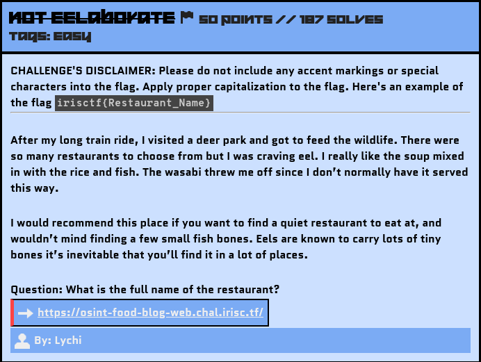
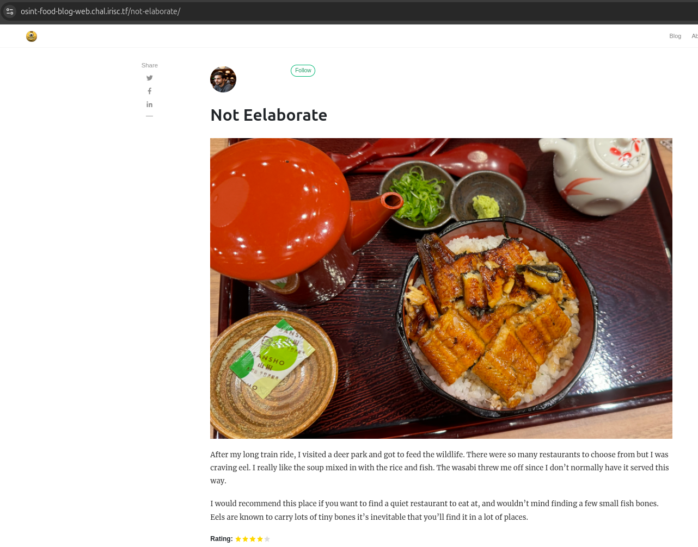
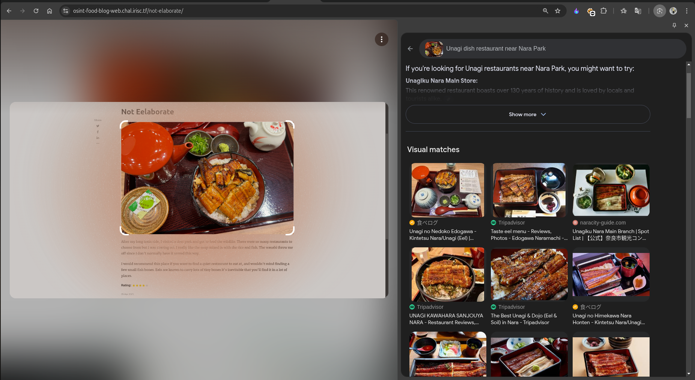
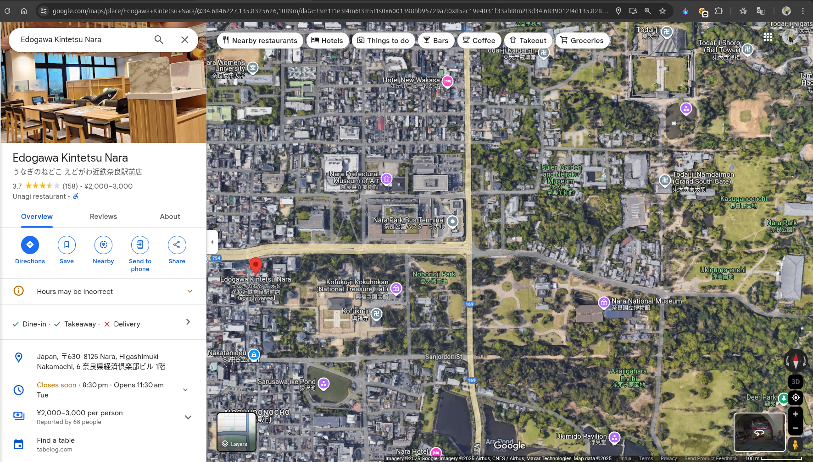

# Not Eelaborate

## Challenge Description



Blog's Link: https://osint-food-blog-web.chal.irisc.tf/

## Solution

If you came directly to this challenge's writeup, I will recommend you first read my `Checking Out Of Winter` writeup because I have made it in detail, specifying some important notes.

So again, let's search for the keywords. I got these: *Title - Eel, Deer Park, Japenese Food, Quiet Restaurant*- traces left by the victim that can help us move forward.

Let's visit the website for this blog:



So, I started searching for Deer Parks in Japan and found one famous Deer Park, `Nara Park`, which helped me narrow down my search.

The food dishes mentioned in the blog hinted at the `Unagi Dish`. I then did a Reverse Image Search for the given image using the prompt `Unagi Dish Restaurant near Nara Park`. This search suggested some restaurants, and the first restaurant had a similar dish plate, as shown below:



Finally, search for the restaurant on Google Maps, and you will get the correct name, which is located near Nara Park.



Location: [Edogawa Kintetsu Nara](https://maps.app.goo.gl/d2VqjxsCzop5jx1y6)

### Creating the Flag
With the gathered information, let's construct the flag using the defined format.

Flag: 
```yaml
irisctf{Edogawa_Kintetsu_Nara}
```
One more solved!