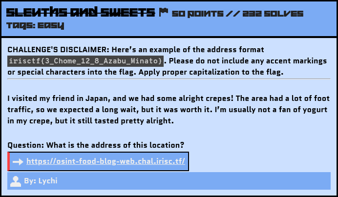
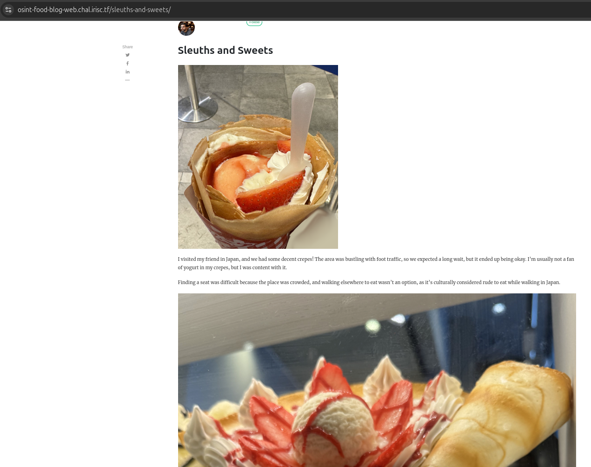
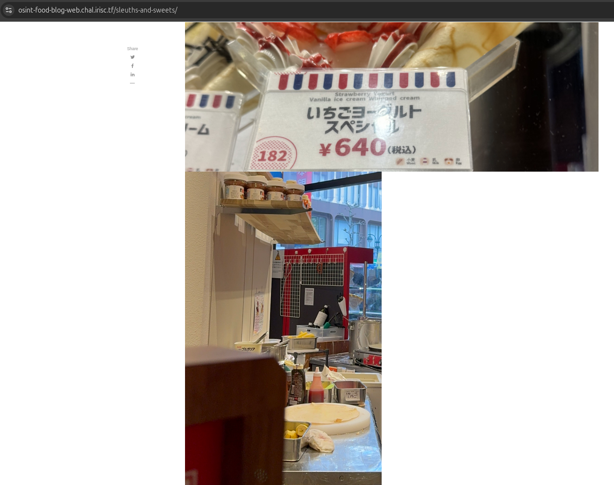
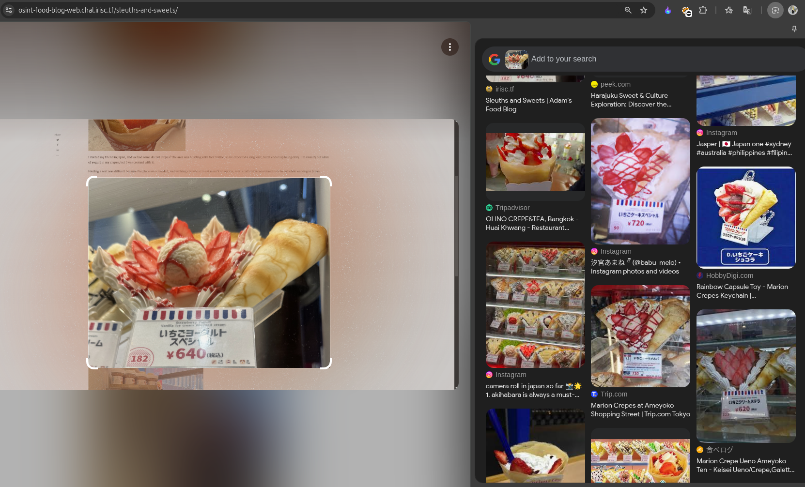
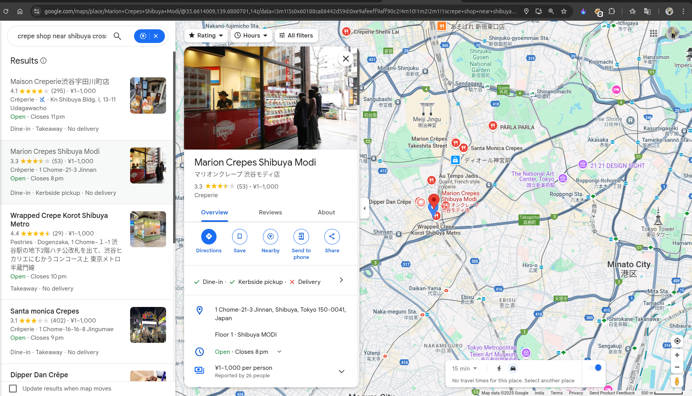

# Sleuths and Sweets

## Challenge Description



Blog's Link: https://osint-food-blog-web.chal.irisc.tf/

## Solution

If you came directly to this challenge's writeup, I will recommend you first read my `Checking Out Of Winter` writeup because I have made it in detail, specifying some important notes.

So again, let's search for the keywords. I got these: *Japan, Crepes, Foot Traffic*—traces left by the victim that can help us move forward.

Let's visit the website for this blog:




This time, we had 3 images. When I did a Reverse Image Search for the 1st and the 3rd images, I didn’t get much exact information because they looked very common across Japan.

When I did a Reverse Image Search for the 2nd image, I got these results:



Suggesting `Marion Crepe Ueno Ameyoko Store`, which was not the correct address for the flag. 

### Exploring other way

So this time, I tried another method. As the description mentioned Foot Traffic, I searched for the place with the highest foot traffic in Japan. 

```
The place with the highest foot traffic in Japan is Shibuya Crossing in Tokyo, which is widely considered the busiest pedestrian crossing in the world, with thousands of people crossing at once during rush hour. 
```

I then refined my search for crepe shops near Shibuya Crossing on Google Maps. After checking several stores, I finally found the correct one, as shown below:



Location: [Marion Crepes Shibuya Modi](https://maps.app.goo.gl/9np7WRbr9eapY6dZ9)

It had similar images to those given in the blog.

### Creating the Flag
With the gathered information, let's construct the flag using the defined format.

Flag: 

```yaml
irisctf{1_Chome_21_3_Jinnan_Shibuya}
```

Another one solved! 🥳 