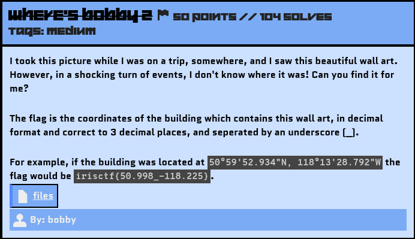
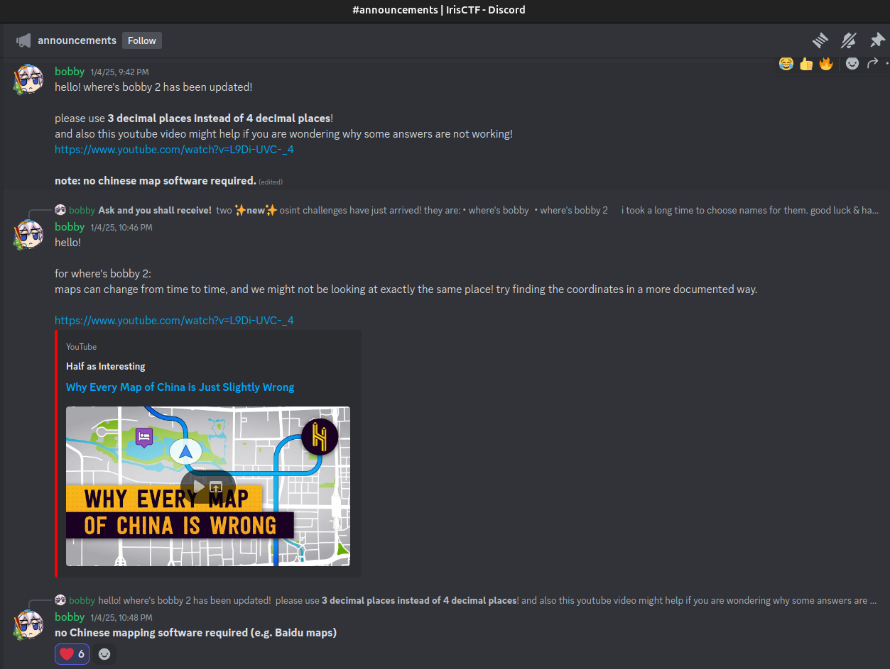
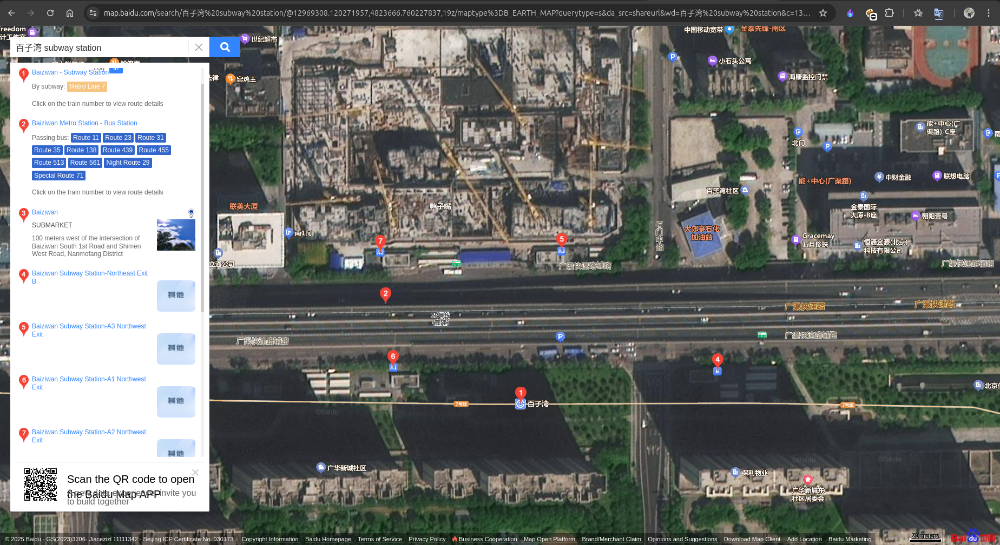
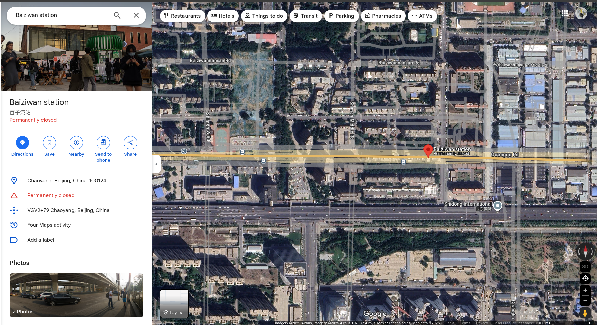
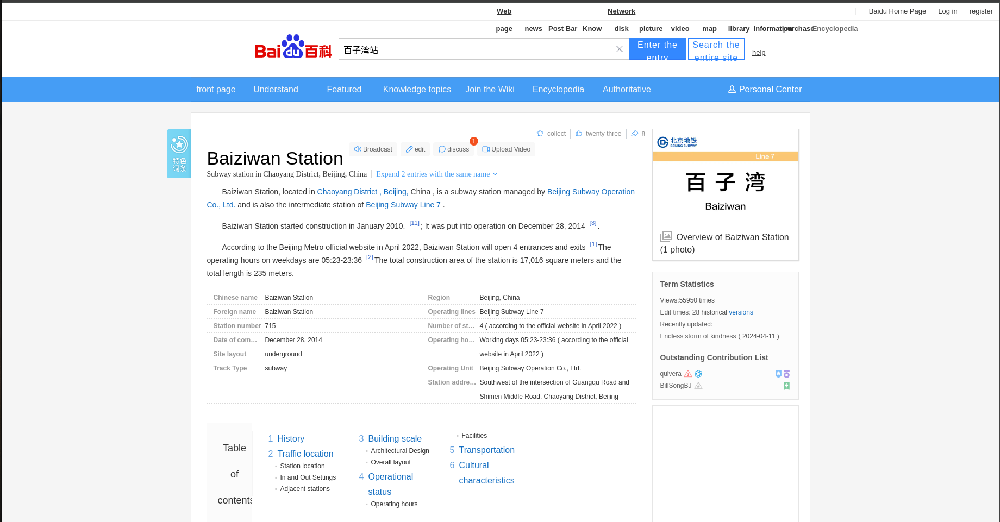
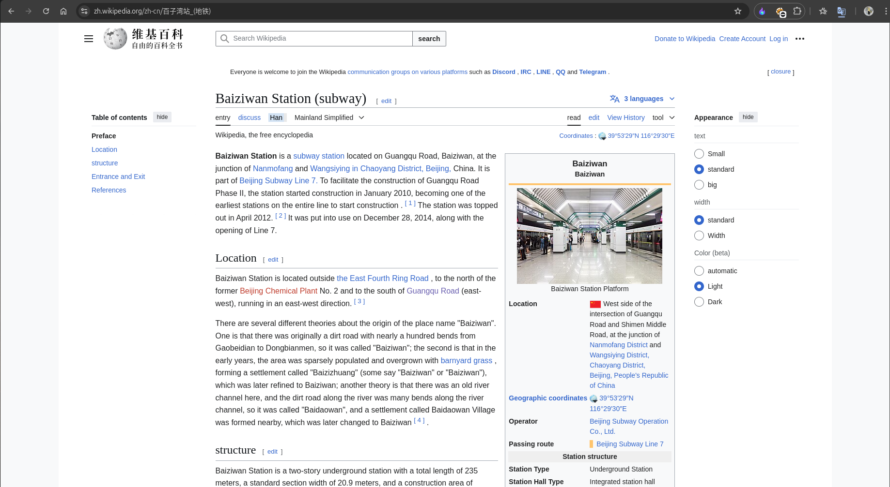
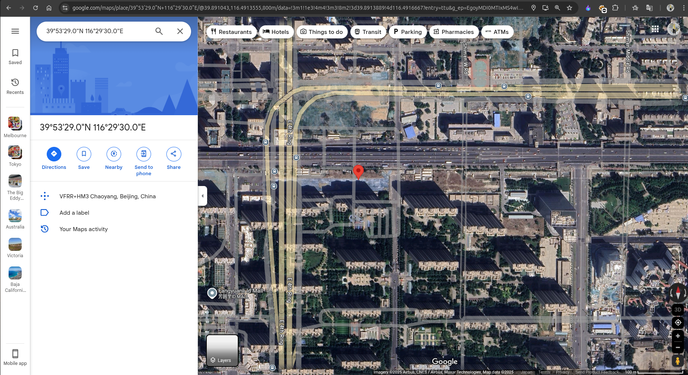

# Where's Bobby 2

## Challenge Description



Source File: [files](./assets/wheres-bobby-2.tar.gz)

Hints released on Discord Announcements:


Youtube Video Link: https://www.youtube.com/watch?v=L9Di-UVC-_4

## Solution

If you came directly to this challenge's writeup, I will recommend you first read my `Checking Out Of Winter` writeup because I have made it in detail, specifying some important notes.

Provided Image:


I did a Reverse Image Search using Google Lens and found these helpful sites:
```
- https://ameblo.jp/yorinoto/entry-12733913890.html
- https://m.sohu.com/a/545522713_99946287/?pvid=000115_3w_a
```
After exploring these sites, I discovered that the location name is `Bai Zi Wan Subway Station`, and the wall art is `"Hundred Ziwan Kissho" / "The Hundred Children Playing in Baizi Bay"` painting.

### The Challenge with Finding the Coordinates

Finding the exact coordinates was tough for non-Chinese users because all locations on Google Maps for China are shifted by a few units. You can learn more about this issue from the provided YouTube video.

Although it was mentioned not to use Chinese maps or software, I took a look on the `Baidu Map`.



As shown, the main station and the exit buildings are located at the bottom part of the image.

When I checked Google Maps, I got this result:



The coordinates were shifted, and submitting them didn’t yield the correct result.

I also tried the English version of Wikipedia, which had the coordinates for the station, but again, they were incorrect. Wikipedia then directed me to Bing Maps:


However, the coordinates from Bing Maps were also inaccurate.

### Exploring Other Sources

Next, I started searching for documented articles that might include the exact coordinates for the station. I looked at the [Baidu Encyclopedia](https://baike.baidu.com/) site:



Unfortunately, it didn’t mention any coordinates.

Finally, after more extensive searching 😵‍💫, I found the Chinese-language version of [Wikipedia](https://zh.wikipedia.org/zh-cn), specifically tailored for Simplified Chinese characters (used in Mainland China and Singapore).



Link: https://zh.wikipedia.org/zh-cn/%E7%99%BE%E5%AD%90%E6%B9%BE%E7%AB%99_(%E5%9C%B0%E9%93%81)

This page included the coordinates.

### Verifying the Coordinates
I quickly entered the coordinates on Google Maps. Although the result was still shifted from the exact building, I refined the search as shown below:



Coordinates: 39.891389, 116.491667

I rounded off the coordinates to 3 decimal points: 39.891, 116.492.

After submitting these refined coordinates, I confirmed that they were the desired ones for this challenge. 😮‍💨

Flag: 
```yaml
irisctf{39.891_116.492}
```

*This marks the last challenge based on the files. Thanks to `bobby` for creating this amazing challenge; I really enjoyed it.*