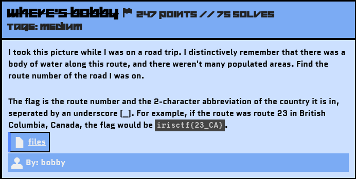
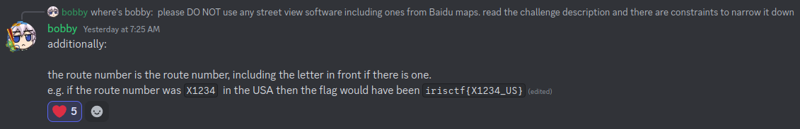
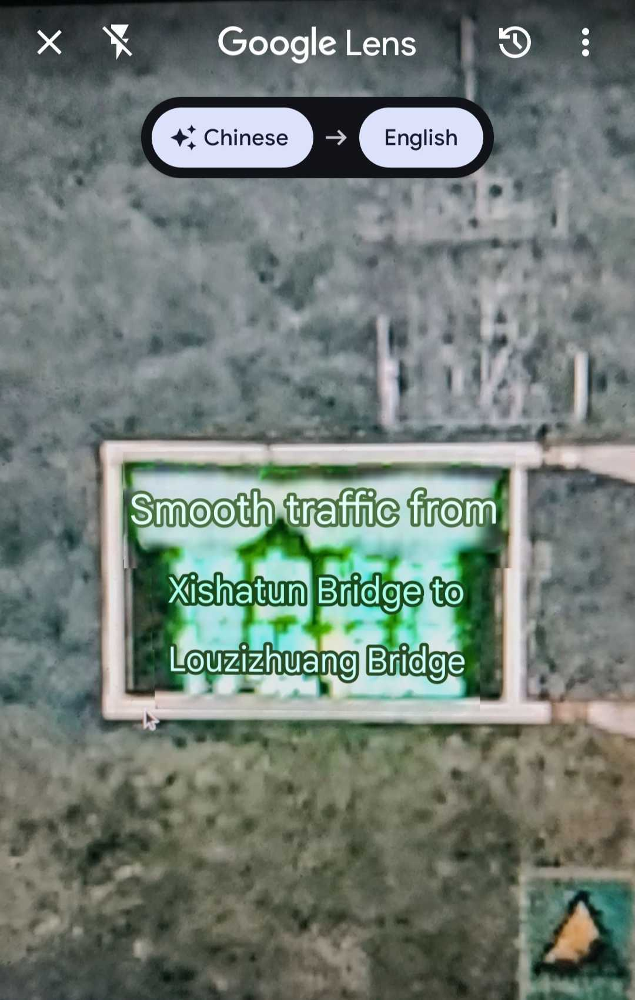

# Where's Bobby

## Challenge Description



Source File: [files](./assets/wheres-bobby.tar.gz)

Hints releasd on Discord Announcements:



## Solution

If you came directly to this challenge's writeup, I will recommend you first read my `Checking Out Of Winter` writeup because I have made it in detail, specifying some important notes.

So again, let's search for the keywords. I got these: *Road Trip, Water Body, Not much populated areas* - traces left by the author.

Provided Image:


<!--  -->

I like the view of the image. This image was taken from a car on a road that appears to be in the middle of the mountains.

When we zoom in on the image, we can see something written in Chinese on the board. I checked it using Google Translator:



<!--  -->

Translated Text in the above image:
```
Smooth traffic from Xishatun Bridge to Louzizhuang Bridge.
```

The board was showing the traffic conditions of the upcoming bridges, which means the author was about to enter this bridge via the connected roads from where they were coming.

The possible routes near these two bridges are:
G7, G6, G4501, S216, S321, S3801.


As the author mentioned the surroundings of the route as *Water Body, Not much populated areas*, the road in the provided image was surrounded by mountains.

With these specifications, I started matching the description with the route numbers found earlier:

- I couldn’t find a water body around G7.
- G6 was heavily populated.
- G4501 was not deep into the mountains.
- S216 and S321 were primarily in city regions.
- Lastly, S3801 had water bodies and very sparsely populated areas around it, which led me to consider it for flag verification.

### Creating the Flag
With the gathered information, let's construct the flag using the defined format.

Hooray! It was the correct flag!!!

Flag: 
```yaml
irisctf{S3801_CN}
```